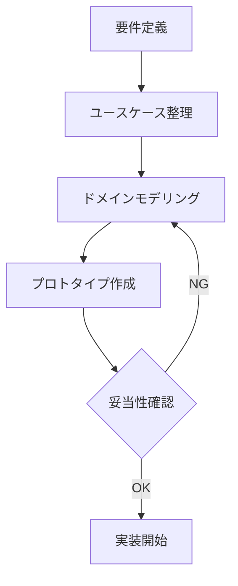

# プロジェクト改善提案書

## 📋 目次
1. [アーキテクチャ設計の改善](#アーキテクチャ設計の改善)
2. [データベース設計の改善](#データベース設計の改善)
3. [RLS戦略の改善](#rls戦略の改善)
4. [開発プロセスの改善](#開発プロセスの改善)
5. [コード品質の改善](#コード品質の改善)
6. [ユーザー体験の改善](#ユーザー体験の改善)
7. [実装の優先順位](#実装の優先順位)

---

## アーキテクチャ設計の改善

### 🔴 実際に発生した問題

#### 1. グループベース → リストベースへの大規模ピボット
- **問題**: 最初に「家族全員で1つのグループ」という設計で実装
- **影響**: 仕様変更時に大規模なマイグレーションが必要に
- **工数**: データベース再設計、RLS修正、UI全面改修

#### 2. RLSの循環参照問題
- **問題**: テーブル間の相互参照により無限ループ
- **発生回数**: 3回（task_list_members, task_lists, tasks）
- **解決時間**: 各2-3時間のデバッグ

### ✅ 改善案

#### 1. 初期段階でのドメインモデリング

**実施すべきだったこと:**
```
1. ユースケース分析（1-2日）
   - 誰が何を共有したいのか
   - どのような粒度で共有するのか
   - 将来の拡張性は？

2. ドメインモデルの作成
   - Entity（エンティティ）の洗い出し
   - Relationship（関係性）の定義
   - Access Control（アクセス制御）の設計

3. プロトタイプでの検証
   - Figmaで画面遷移を作成
   - ユーザーストーリーの確認
   - データモデルの妥当性検証
```

**具体的な設計プロセス:**


#### 2. 最初からリストベース設計

**当初の設計（問題あり）:**
```typescript
// ❌ グループ中心の設計
interface Group {
  id: string;
  name: string;
}

interface Task {
  id: string;
  title: string;
  category: string;  // お使い、イベントなど
  group_id: string;
}
```

**最適な設計（最初からこうすべきだった）:**
```typescript
// ✅ リスト中心の設計
interface TaskList {
  id: string;
  name: string;
  owner_id: string;
  visibility: 'private' | 'shared';  // 将来の拡張に対応
}

interface Task {
  id: string;
  title: string;
  task_list_id: string;
  // カテゴリは不要（リスト自体がカテゴリ）
}
```

---

## データベース設計の改善

### 🔴 実際に発生した問題

#### 1. マイグレーション地獄
- 実行したSQL修正スクリプト: **12個**
- `category`カラムの削除忘れ
- `group_id`の残存

#### 2. RLS無限再帰
- **根本原因**: テーブル間の依存関係を図示していなかった

### ✅ 改善案

#### 1. スキーマ設計時のチェックリスト

```markdown
## データベース設計チェックリスト

### 1. ER図の作成（必須）
- [ ] Mermaid/dbdiagram.ioで図示
- [ ] 全ての外部キー制約を記載
- [ ] カスケード削除の動作を確認

### 2. インデックス戦略
- [ ] 検索に使うカラムにインデックス
- [ ] JOIN対象のカラムにインデックス
- [ ] ユニーク制約の確認

### 3. RLS設計（最重要）
- [ ] RLS依存関係図を作成
- [ ] 循環参照がないことを確認
- [ ] SECURITY DEFINER関数の必要性を検討

### 4. マイグレーション戦略
- [ ] ロールバック手順を記載
- [ ] データ保全の確認クエリを用意
- [ ] 本番環境での実行手順を文書化
```

#### 2. RLS依存関係図（最初に作成すべき）

```
┌─────────────────────────────────────────┐
│ RLS依存関係図（循環参照チェック用）      │
└─────────────────────────────────────────┘

task_lists (SELECT)
  ├─ owner_id = auth.uid() ✅ 直接参照（安全）
  └─ is_task_list_member() ⚠️ 関数（要確認）
       └─ task_list_members (SELECT) ← 循環の可能性！
            └─ user_id = auth.uid() ✅ 直接参照

【対策】
1. is_task_list_member() を SECURITY DEFINER にする
2. task_list_members のポリシーはシンプルに（自分のレコードのみ）
```

#### 3. 初期スキーマ（理想形）

```sql
-- ============================================
-- 最初からこの設計で実装すべきだった
-- ============================================

-- 1. task_lists（コア）
CREATE TABLE task_lists (
  id UUID PRIMARY KEY DEFAULT gen_random_uuid(),
  name TEXT NOT NULL,
  owner_id UUID NOT NULL REFERENCES auth.users(id) ON DELETE CASCADE,
  visibility TEXT NOT NULL DEFAULT 'private' CHECK (visibility IN ('private', 'shared', 'public')),
  invite_token TEXT UNIQUE,
  icon TEXT,  -- 将来の拡張用
  color TEXT, -- 将来の拡張用
  created_at TIMESTAMP WITH TIME ZONE DEFAULT NOW() NOT NULL,
  updated_at TIMESTAMP WITH TIME ZONE DEFAULT NOW() NOT NULL,
  
  -- インデックス
  INDEX idx_task_lists_owner_id (owner_id),
  INDEX idx_task_lists_invite_token (invite_token)
);

-- 2. task_list_members（権限管理）
CREATE TABLE task_list_members (
  id UUID PRIMARY KEY DEFAULT gen_random_uuid(),
  task_list_id UUID NOT NULL REFERENCES task_lists(id) ON DELETE CASCADE,
  user_id UUID NOT NULL REFERENCES auth.users(id) ON DELETE CASCADE,
  user_email TEXT NOT NULL,
  role TEXT NOT NULL DEFAULT 'member' CHECK (role IN ('owner', 'editor', 'viewer')),
  joined_at TIMESTAMP WITH TIME ZONE DEFAULT NOW() NOT NULL,
  
  UNIQUE(task_list_id, user_id),
  INDEX idx_task_list_members_list_id (task_list_id),
  INDEX idx_task_list_members_user_id (user_id)
);

-- 3. tasks（シンプルに）
CREATE TABLE tasks (
  id UUID PRIMARY KEY DEFAULT gen_random_uuid(),
  title TEXT NOT NULL,
  description TEXT,  -- 将来の拡張用
  task_list_id UUID NOT NULL REFERENCES task_lists(id) ON DELETE CASCADE,
  is_completed BOOLEAN NOT NULL DEFAULT false,
  completed_at TIMESTAMP WITH TIME ZONE,
  due_date TIMESTAMP WITH TIME ZONE,  -- 将来の拡張用
  priority TEXT CHECK (priority IN ('low', 'medium', 'high')),  -- 将来の拡張用
  created_by UUID NOT NULL REFERENCES auth.users(id) ON DELETE CASCADE,
  created_at TIMESTAMP WITH TIME ZONE DEFAULT NOW() NOT NULL,
  updated_at TIMESTAMP WITH TIME ZONE DEFAULT NOW() NOT NULL,
  
  INDEX idx_tasks_list_id (task_list_id),
  INDEX idx_tasks_created_by (created_by),
  INDEX idx_tasks_completed (is_completed)
);

-- 4. RLS用のヘルパー関数（最初から定義）
CREATE OR REPLACE FUNCTION user_can_access_list(p_list_id uuid)
RETURNS boolean
LANGUAGE sql
SECURITY DEFINER
STABLE
AS $$
  SELECT EXISTS (
    SELECT 1 FROM task_lists tl
    WHERE tl.id = p_list_id
    AND (
      tl.owner_id = auth.uid()
      OR EXISTS (
        SELECT 1 FROM task_list_members tlm
        WHERE tlm.task_list_id = p_list_id
        AND tlm.user_id = auth.uid()
      )
    )
  );
$$;

-- 5. シンプルなRLSポリシー
ALTER TABLE task_lists ENABLE ROW LEVEL SECURITY;
CREATE POLICY task_lists_select ON task_lists FOR SELECT
  USING (owner_id = auth.uid() OR user_can_access_list(id));

ALTER TABLE task_list_members ENABLE ROW LEVEL SECURITY;
CREATE POLICY task_list_members_select ON task_list_members FOR SELECT
  USING (user_id = auth.uid());

ALTER TABLE tasks ENABLE ROW LEVEL SECURITY;
CREATE POLICY tasks_select ON tasks FOR SELECT
  USING (user_can_access_list(task_list_id));
```

---

## RLS戦略の改善

### 🔴 実際に発生した問題

**問題の連鎖:**
1. `task_list_members` の SELECT → 無限再帰
2. 修正 → `task_lists` で新たな無限再帰
3. 再修正 → `tasks` で無限再帰
4. 最終修正 → SECURITY DEFINER 関数導入

**デバッグ時間:** 約6時間

### ✅ 改善案

#### RLS設計の原則（最初に確立すべき）

```markdown
## RLS設計の鉄則

### 1. 依存関係は一方向にする
❌ A → B, B → A（循環参照）
✅ A → B → C（一方向）

### 2. 複雑なロジックは関数化
❌ ポリシー内で複雑なサブクエリ
✅ SECURITY DEFINER 関数で抽象化

### 3. 最小権限の原則
❌ 「とりあえず全部見える」
✅ 「必要最小限のみアクセス可能」

### 4. テスト駆動でポリシーを作成
```sql
-- ポリシー作成前に期待する動作をテストケースとして記載
-- テスト1: オーナーは自分のリストを見られる
-- テスト2: メンバーは参加しているリストを見られる
-- テスト3: 非メンバーはリストを見られない
```
```

#### RLS実装のベストプラクティス

```sql
-- ============================================
-- RLS実装テンプレート（推奨パターン）
-- ============================================

-- Step 1: ヘルパー関数を先に定義
CREATE OR REPLACE FUNCTION is_list_owner(p_list_id uuid, p_user_id uuid)
RETURNS boolean
LANGUAGE sql
SECURITY DEFINER
STABLE
AS $$
  SELECT EXISTS (
    SELECT 1 FROM task_lists
    WHERE id = p_list_id AND owner_id = p_user_id
  );
$$;

CREATE OR REPLACE FUNCTION is_list_member(p_list_id uuid, p_user_id uuid)
RETURNS boolean
LANGUAGE sql
SECURITY DEFINER
STABLE
AS $$
  SELECT EXISTS (
    SELECT 1 FROM task_list_members
    WHERE task_list_id = p_list_id AND user_id = p_user_id
  );
$$;

-- Step 2: シンプルなポリシー（関数を使用）
CREATE POLICY task_lists_crud ON task_lists
  USING (
    CASE
      WHEN current_setting('request.method', true) = 'SELECT' THEN
        is_list_owner(id, auth.uid()) OR is_list_member(id, auth.uid())
      WHEN current_setting('request.method', true) = 'UPDATE' THEN
        is_list_owner(id, auth.uid())
      WHEN current_setting('request.method', true) = 'DELETE' THEN
        is_list_owner(id, auth.uid())
      ELSE false
    END
  );
```

---

## 開発プロセスの改善

### 🔴 実際に発生した問題

1. **手動デプロイ**: Supabaseで12個のSQLスクリプトを手動実行
2. **テスト不足**: 本番環境で初めて発見されるバグ
3. **ドキュメント後回し**: 実装中に仕様を忘れる

### ✅ 改善案

#### 1. 開発環境の整備

```bash
# プロジェクト構造（理想形）
.
├── supabase/
│   ├── migrations/          # マイグレーションファイル（自動管理）
│   │   ├── 20260301000000_initial_schema.sql
│   │   ├── 20260302000000_add_rls_policies.sql
│   │   └── 20260303000000_add_helper_functions.sql
│   ├── seed.sql             # 開発用データ
│   └── config.toml          # Supabase設定
├── tests/
│   ├── unit/                # ユニットテスト
│   ├── integration/         # 統合テスト
│   └── e2e/                 # E2Eテスト
├── docs/
│   ├── architecture.md      # アーキテクチャ設計書
│   ├── database.md          # DB設計書
│   └── api.md               # API仕様書
└── scripts/
    ├── setup.sh             # 開発環境セットアップ
    └── deploy.sh            # デプロイスクリプト
```

#### 2. Supabase CLI の活用

```bash
# 初期化（最初にやるべきだった）
supabase init

# ローカル開発環境の起動
supabase start

# マイグレーション作成
supabase migration new add_task_lists

# マイグレーション適用
supabase db push

# 本番環境へのデプロイ
supabase db push --linked
```

#### 3. CI/CD パイプライン

```yaml
# .github/workflows/ci.yml
name: CI

on: [push, pull_request]

jobs:
  test:
    runs-on: ubuntu-latest
    steps:
      - uses: actions/checkout@v3
      
      - name: Setup Supabase
        run: |
          supabase start
          supabase db push
      
      - name: Run tests
        run: npm test
      
      - name: Lint
        run: npm run lint
      
      - name: Build
        run: npm run build

  deploy:
    needs: test
    if: github.ref == 'refs/heads/main'
    runs-on: ubuntu-latest
    steps:
      - name: Deploy to Vercel
        run: vercel --prod
      
      - name: Apply migrations
        run: supabase db push --linked
```

---

## コード品質の改善

### 🔴 実際に発生した問題

1. **型定義の不統一**: `Task`, `TaskList` が複数箇所で重複定義
2. **エラーハンドリングの不統一**: `console.error` だけでユーザーに伝わらない
3. **コンポーネントの肥大化**: `page.tsx` が700行超え

### ✅ 改善案

#### 1. ディレクトリ構造

```
src/
├── types/
│   ├── database.ts          # Supabase生成の型
│   ├── domain.ts            # ドメイン型
│   └── api.ts               # API型
├── lib/
│   ├── supabase/
│   │   ├── client.ts
│   │   ├── server.ts
│   │   └── middleware.ts
│   └── utils/
│       ├── date.ts
│       └── validation.ts
├── hooks/
│   ├── useTaskLists.ts      # リストのCRUD
│   ├── useTasks.ts          # タスクのCRUD
│   └── useRealtimeSync.ts   # リアルタイム同期
├── components/
│   ├── features/
│   │   ├── TaskList/
│   │   │   ├── TaskListCard.tsx
│   │   │   ├── TaskListForm.tsx
│   │   │   └── index.ts
│   │   └── Task/
│   │       ├── TaskItem.tsx
│   │       └── TaskForm.tsx
│   └── ui/
│       ├── Button.tsx
│       ├── Input.tsx
│       └── Modal.tsx
└── app/
    ├── (auth)/
    │   └── login/
    └── (main)/
        ├── page.tsx         # 100行以内
        └── layout.tsx
```

#### 2. 型定義の統一

```typescript
// src/types/database.ts (Supabaseから自動生成)
export type Database = {
  public: {
    Tables: {
      task_lists: {
        Row: { ... },
        Insert: { ... },
        Update: { ... }
      }
    }
  }
}

// src/types/domain.ts (ドメインロジック用)
import type { Database } from './database'

export type TaskList = Database['public']['Tables']['task_lists']['Row']
export type TaskListInsert = Database['public']['Tables']['task_lists']['Insert']

// 追加のビジネスロジック型
export type TaskListWithStats = TaskList & {
  taskCount: number
  completedCount: number
  members: Member[]
}
```

#### 3. カスタムフックで責務分離

```typescript
// hooks/useTaskLists.ts
export function useTaskLists() {
  const [lists, setLists] = useState<TaskList[]>([])
  const [loading, setLoading] = useState(true)
  const [error, setError] = useState<Error | null>(null)

  // CRUD操作を全てここに集約
  const fetchLists = async () => { ... }
  const createList = async (data: TaskListInsert) => { ... }
  const updateList = async (id: string, data: Partial<TaskList>) => { ... }
  const deleteList = async (id: string) => { ... }

  useEffect(() => {
    fetchLists()
  }, [])

  return { lists, loading, error, fetchLists, createList, updateList, deleteList }
}

// page.tsx（100行以内に収まる）
export default function Home() {
  const { lists, loading, createList } = useTaskLists()
  const { tasks, addTask } = useTasks()
  
  if (loading) return <LoadingSpinner />
  
  return <TaskListView lists={lists} onCreateList={createList} />
}
```

---

## ユーザー体験の改善

### 🔴 実装できなかった機能

1. **オフライン対応**: ネットワーク切断時に操作できない
2. **プッシュ通知**: タスク追加をリアルタイムで知らせられない
3. **ドラッグ&ドロップ**: タスクの並び替えができない

### ✅ 改善案

#### 1. Progressive Web App (PWA)

```typescript
// next.config.js
const withPWA = require('next-pwa')({
  dest: 'public',
  register: true,
  skipWaiting: true,
})

module.exports = withPWA({
  // 既存の設定
})

// Service Worker でオフライン対応
self.addEventListener('fetch', (event) => {
  event.respondWith(
    caches.match(event.request).then((response) => {
      return response || fetch(event.request)
    })
  )
})
```

#### 2. 楽観的UI + 同期キュー

```typescript
// lib/syncQueue.ts
export class SyncQueue {
  private queue: Operation[] = []

  async addTask(task: TaskInsert) {
    // 即座にUIに反映
    optimisticallyUpdate(task)
    
    // キューに追加
    this.queue.push({ type: 'INSERT', table: 'tasks', data: task })
    
    // オンライン時に同期
    if (navigator.onLine) {
      await this.flush()
    }
  }

  async flush() {
    while (this.queue.length > 0) {
      const op = this.queue.shift()
      await executeOperation(op)
    }
  }
}
```

#### 3. 通知システム

```typescript
// hooks/useNotifications.ts
export function useNotifications() {
  useEffect(() => {
    // 通知権限をリクエスト
    Notification.requestPermission()
    
    // Supabase Realtime で新しいタスクを監視
    const channel = supabase
      .channel('task_notifications')
      .on('postgres_changes', {
        event: 'INSERT',
        schema: 'public',
        table: 'tasks'
      }, (payload) => {
        new Notification('新しいやることが追加されました', {
          body: payload.new.title
        })
      })
      .subscribe()
    
    return () => supabase.removeChannel(channel)
  }, [])
}
```

---

## 実装の優先順位

### プロジェクトを最初からやり直す場合のロードマップ

#### Phase 1: 基礎設計（1週間）
1. ✅ 要件定義・ユースケース整理
2. ✅ ドメインモデリング
3. ✅ ER図・RLS依存関係図作成
4. ✅ Figmaプロトタイプ
5. ✅ 技術スタック確定

#### Phase 2: 開発環境構築（2-3日）
1. ✅ Supabase CLI セットアップ
2. ✅ 初期スキーマ＆マイグレーション
3. ✅ RLSポリシー実装
4. ✅ ヘルパー関数定義
5. ✅ 型定義生成

#### Phase 3: MVP実装（1-2週間）
1. ✅ 認証機能
2. ✅ リスト CRUD
3. ✅ タスク CRUD
4. ✅ リアルタイム同期
5. ✅ 基本的なUI

#### Phase 4: 共有機能（3-4日）
1. ✅ 招待リンク生成
2. ✅ メンバー管理
3. ✅ 権限制御

#### Phase 5: UX改善（1週間）
1. ✅ 楽観的UI更新
2. ✅ エラーハンドリング
3. ✅ ローディング状態
4. ✅ モバイル最適化

#### Phase 6: 品質向上（継続的）
1. ✅ ユニットテスト
2. ✅ E2Eテスト
3. ✅ パフォーマンス測定
4. ✅ ドキュメント整備

---

## まとめ：最も重要な教訓

### 🎯 Top 5 改善ポイント

1. **設計に時間をかける**
   - 実装前に1週間の設計期間を確保
   - ER図・RLS依存関係図を必ず作成

2. **Supabase CLI を最初から使う**
   - 手動SQLスクリプト実行は避ける
   - マイグレーション管理を自動化

3. **RLS は SECURITY DEFINER 関数を前提に**
   - 複雑なポリシーは最初から関数化
   - 循環参照を事前に回避

4. **コンポーネント分割を徹底**
   - 1ファイル200行以内を目標
   - カスタムフックで責務分離

5. **ドキュメントを並行作成**
   - 実装しながら設計書を更新
   - README は最優先で整備

---

**作成日**: 2026-03-01  
**対象プロジェクト**: 連絡帳（リストベースToDo管理アプリ）
