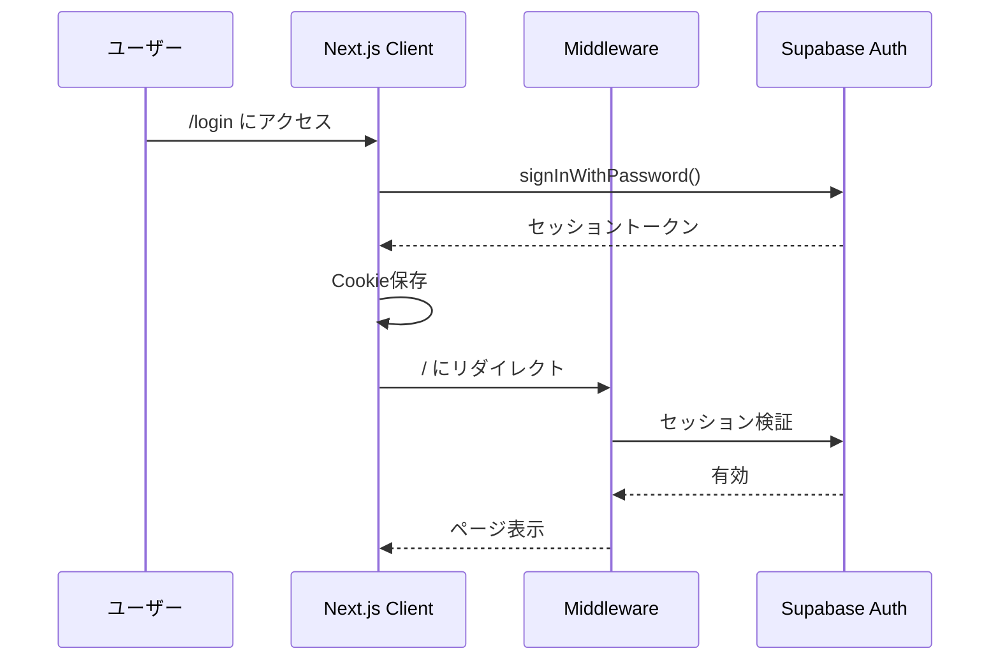

# 家族のToDo - 技術説明書

## 📋 目次
1. [概要](#概要)
2. [アーキテクチャ](#アーキテクチャ)
3. [技術スタック](#技術スタック)
4. [データベース設計](#データベース設計)
5. [セキュリティ設計](#セキュリティ設計)
6. [認証・認可フロー](#認証認可フロー)
7. [共有機能の実装](#共有機能の実装)
8. [リアルタイム同期](#リアルタイム同期)
9. [デプロイ構成](#デプロイ構成)
10. [パフォーマンス最適化](#パフォーマンス最適化)

---

## 概要

### サービス概要
家族や友人間でタスクリストを共有できるリアルタイムToDo管理アプリケーション。
リストごとに共有相手を選択できる柔軟な設計により、プライバシーとコラボレーションを両立。

### 主要機能
- ✅ リストベースのタスク管理（用途別に複数リスト作成）
- 👥 リスト単位の選択的共有（招待リンク方式）
- 🔄 リアルタイム同期（全メンバー間で即時反映）
- 🔐 Row Level Security（RLS）によるデータ保護
- 📱 モバイルファーストUI（iPhone最適化）
- ⚡ 楽観的UI更新（操作の即座反映）

---

## アーキテクチャ

### システム構成図
```
[クライアント (Next.js SSR)]
          ↕ HTTPS
[Vercel Edge Network]
          ↕
[Supabase BaaS]
  ├─ PostgreSQL (データ永続化)
  ├─ Realtime Server (WebSocket)
  ├─ Auth Service (認証)
  └─ Row Level Security (認可)
```

### アーキテクチャの特徴
- **サーバーレス構成**: インフラ管理不要、自動スケール
- **エッジデプロイ**: Vercelのグローバルエッジでレイテンシ最小化
- **BaaS活用**: Supabaseで認証・DB・リアルタイム機能を統合

---

## 技術スタック

### フロントエンド
| 技術 | バージョン | 用途 |
|------|-----------|------|
| Next.js | 14+ (App Router) | Reactフレームワーク、SSR/SSG |
| React | 18+ | UIライブラリ |
| TypeScript | 5+ | 型安全性 |
| Tailwind CSS | 3+ | ユーティリティファーストCSS |

### バックエンド・インフラ
| 技術 | 用途 |
|------|------|
| Supabase | BaaS（Auth, PostgreSQL, Realtime） |
| PostgreSQL | 14+ リレーショナルデータベース |
| Vercel | ホスティング、CI/CD |

### 開発・運用
| ツール | 用途 |
|--------|------|
| Git/GitHub | バージョン管理 |
| npm | パッケージ管理 |
| ESLint | コード品質 |

---

## データベース設計

### ER図
```
┌─────────────┐       ┌──────────────────┐       ┌─────────┐
│ task_lists  │◄──┐   │ task_list_members│   ┌──►│  tasks  │
├─────────────┤   │   ├──────────────────┤   │   ├─────────┤
│ id (PK)     │   └───│ task_list_id (FK)│   │   │ id (PK) │
│ name        │       │ user_id (FK)     │   │   │ title   │
│ owner_id    │       │ user_email       │   │   │ task_list_id (FK)
│ is_shared   │       │ role             │   │   │ is_completed│
│ invite_token│       │ joined_at        │   │   │ user_id │
│ created_at  │       └──────────────────┘   │   │ created_at│
└─────────────┘                              │   └─────────┘
      │                                      │
      └──────────────────────────────────────┘
```

### テーブル設計詳細

#### task_lists（タスクリスト）
```sql
CREATE TABLE task_lists (
  id UUID PRIMARY KEY DEFAULT gen_random_uuid(),
  name TEXT NOT NULL,
  owner_id UUID NOT NULL REFERENCES auth.users(id) ON DELETE CASCADE,
  is_shared BOOLEAN NOT NULL DEFAULT false,
  invite_token TEXT UNIQUE,
  created_at TIMESTAMP WITH TIME ZONE DEFAULT NOW() NOT NULL,
  updated_at TIMESTAMP WITH TIME ZONE DEFAULT NOW() NOT NULL
);

CREATE INDEX task_lists_owner_id_idx ON task_lists(owner_id);
CREATE INDEX task_lists_invite_token_idx ON task_lists(invite_token);
```

#### task_list_members（リストメンバー）
```sql
CREATE TABLE task_list_members (
  id UUID PRIMARY KEY DEFAULT gen_random_uuid(),
  task_list_id UUID NOT NULL REFERENCES task_lists(id) ON DELETE CASCADE,
  user_id UUID NOT NULL REFERENCES auth.users(id) ON DELETE CASCADE,
  user_email TEXT NOT NULL,
  role TEXT NOT NULL DEFAULT 'member' CHECK (role IN ('owner', 'member')),
  joined_at TIMESTAMP WITH TIME ZONE DEFAULT NOW() NOT NULL,
  UNIQUE(task_list_id, user_id)
);

CREATE INDEX task_list_members_task_list_id_idx ON task_list_members(task_list_id);
CREATE INDEX task_list_members_user_id_idx ON task_list_members(user_id);
```

#### tasks（タスク）
```sql
CREATE TABLE tasks (
  id UUID PRIMARY KEY DEFAULT gen_random_uuid(),
  title TEXT NOT NULL,
  task_list_id UUID NOT NULL REFERENCES task_lists(id) ON DELETE CASCADE,
  is_completed BOOLEAN NOT NULL DEFAULT false,
  user_id UUID NOT NULL REFERENCES auth.users(id) ON DELETE CASCADE,
  created_at TIMESTAMP WITH TIME ZONE DEFAULT NOW() NOT NULL
);

CREATE INDEX tasks_task_list_id_idx ON tasks(task_list_id);
CREATE INDEX tasks_user_id_idx ON tasks(user_id);
```

---

## セキュリティ設計

### Row Level Security（RLS）戦略

#### 課題：循環参照の回避
テーブル間の相互参照によるRLS無限ループを回避するため、**SECURITY DEFINER関数**を使用。

#### 実装パターン

**1. ヘルパー関数（SECURITY DEFINER）**
```sql
-- メンバーシップチェック（RLSバイパス）
CREATE FUNCTION is_task_list_member(p_list_id uuid, check_user_id uuid)
RETURNS boolean
LANGUAGE sql
SECURITY DEFINER
STABLE
AS $$
  SELECT EXISTS (
    SELECT 1 FROM task_list_members
    WHERE task_list_id = p_list_id
    AND user_id = check_user_id
  );
$$;

-- リストアクセス権チェック
CREATE FUNCTION can_access_task_list(list_id uuid, check_user_id uuid)
RETURNS boolean
LANGUAGE sql
SECURITY DEFINER
STABLE
AS $$
  SELECT EXISTS (
    SELECT 1 FROM task_lists
    WHERE id = list_id
    AND (
      owner_id = check_user_id
      OR is_task_list_member(list_id, check_user_id)
    )
  );
$$;
```

**2. RLSポリシー（シンプルな条件）**
```sql
-- task_lists: オーナーまたはメンバーのみアクセス可能
CREATE POLICY "task_lists_select_policy"
  ON task_lists FOR SELECT
  USING (
    owner_id = auth.uid()
    OR is_task_list_member(id, auth.uid())
  );

-- tasks: リストアクセス権があればアクセス可能
CREATE POLICY "tasks_select_policy"
  ON tasks FOR SELECT
  USING (can_access_task_list(task_list_id, auth.uid()));

-- task_list_members: 自分のメンバーシップのみ見える
CREATE POLICY "task_list_members_select_own"
  ON task_list_members FOR SELECT
  USING (user_id = auth.uid());
```

#### セキュリティ境界
| 操作 | 制約 |
|------|------|
| リスト作成 | 認証済みユーザーのみ |
| リスト閲覧 | オーナーまたはメンバー |
| リスト削除 | オーナーのみ |
| タスク作成/編集 | リストメンバー全員 |
| メンバー追加 | 招待リンク経由のみ（誰でも） |
| メンバー削除 | 自分自身のみ |

---

## 認証・認可フロー

### 認証フロー


### ミドルウェア（middleware.ts）
```typescript
export async function middleware(request: NextRequest) {
  const { user } = await updateSession(request);
  
  // 未認証ユーザーは /login にリダイレクト
  if (!user && !request.nextUrl.pathname.startsWith('/login')) {
    return NextResponse.redirect(new URL('/login', request.url));
  }
  
  // 認証済みユーザーが /login にアクセスしたら / にリダイレクト
  if (user && request.nextUrl.pathname.startsWith('/login')) {
    return NextResponse.redirect(new URL('/', request.url));
  }
}
```

---

## 共有機能の実装

### 招待リンク方式

#### 1. リンク生成
```typescript
const generateShareLink = async (listId: string) => {
  // ランダムトークン生成
  const token = Math.random().toString(36).substring(2, 15) + 
                Math.random().toString(36).substring(2, 15);
  
  // DBに保存
  await supabase
    .from('task_lists')
    .update({ 
      invite_token: token,
      is_shared: true 
    })
    .eq('id', listId);

  return `${window.location.origin}/join/${token}`;
};
```

#### 2. リンク経由の参加
```typescript
// /join/[token]/page.tsx
const handleJoinList = async () => {
  // トークンでリスト検索（SECURITY DEFINER関数使用）
  const { data: taskListData } = await supabase
    .rpc('get_task_list_by_invite_token', { token });
  
  // メンバーテーブルに追加
  await supabase
    .from('task_list_members')
    .insert({
      task_list_id: taskList.id,
      user_id: user.id,
      user_email: user.email,
      role: 'member',
    });
};
```

#### セキュリティ考慮点
- ✅ 招待トークンは一方向（リンク所持者のみアクセス可能）
- ✅ `is_shared = true` でも直接アクセスは不可（関数経由のみ）
- ✅ メンバー追加後はRLSで自動的にアクセス可能に

---

## リアルタイム同期

### Supabase Realtime活用

#### 購読設定
```typescript
const subscribeToChanges = () => {
  const channel = supabase
    .channel('all_changes')
    .on('postgres_changes', { 
      event: '*', 
      schema: 'public', 
      table: 'task_lists' 
    }, () => {
      fetchTaskLists(); // リスト再取得
    })
    .on('postgres_changes', { 
      event: '*', 
      schema: 'public', 
      table: 'tasks' 
    }, () => {
      fetchTaskLists(); // タスク再取得
    })
    .on('postgres_changes', { 
      event: '*', 
      schema: 'public', 
      table: 'task_list_members' 
    }, () => {
      fetchTaskLists(); // メンバー再取得
    })
    .subscribe();

  return () => supabase.removeChannel(channel);
};
```

#### 楽観的UI更新
```typescript
const toggleTask = async (task: Task) => {
  // 1. 即座にUI更新（楽観的）
  setTasksMap(prev => ({
    ...prev,
    [task.task_list_id]: prev[task.task_list_id].map(t =>
      t.id === task.id ? { ...t, is_completed: !t.is_completed } : t
    ),
  }));

  // 2. バックエンド更新
  const { error } = await supabase
    .from('tasks')
    .update({ is_completed: !task.is_completed })
    .eq('id', task.id);

  // 3. エラー時はロールバック
  if (error) {
    console.error('エラー:', error);
    fetchTaskLists(); // 正確な状態を再取得
  }
};
```

---

## デプロイ構成

### Vercel設定

#### 環境変数
```env
NEXT_PUBLIC_SUPABASE_URL=https://xxx.supabase.co
NEXT_PUBLIC_SUPABASE_ANON_KEY=eyJhbGciOiJIUzI1NiIsInR5cCI6IkpXVCJ9...
```

#### ビルド設定
- **Framework**: Next.js
- **Build Command**: `npm run build`
- **Output Directory**: `.next`
- **Install Command**: `npm install`

### Supabase設定

#### プロジェクト作成後の初期化手順
```bash
# 1. SQL Editorで実行
psql < pivot_to_lists.sql

# 2. マイグレーション実行（既存データがある場合）
SELECT migrate_categories_to_lists();

# 3. 必要なRLS修正を順次実行
psql < fix_task_list_members_rls.sql
psql < fix_task_lists_rls.sql
psql < fix_tasks_rls.sql
psql < fix_tasks_schema.sql
psql < fix_security_invite_link.sql
psql < fix_members_circular_reference.sql
psql < fix_get_members_simple.sql
```

---

## パフォーマンス最適化

### 実装済み最適化

#### 1. データベースインデックス
```sql
-- 頻繁に検索されるカラムにインデックス
CREATE INDEX task_lists_owner_id_idx ON task_lists(owner_id);
CREATE INDEX tasks_task_list_id_idx ON tasks(task_list_id);
CREATE INDEX task_list_members_user_id_idx ON task_list_members(user_id);
```

#### 2. クエリ最適化
- **SECURITY DEFINER関数**: RLS評価を最小化
- **並列取得**: `Promise.all()` でタスクとメンバーを同時取得
```typescript
const [tasksResults, membersResults] = await Promise.all([
  Promise.all(tasksPromises),
  Promise.all(membersPromises)
]);
```

#### 3. フロントエンド最適化
- **楽観的UI更新**: サーバーレスポンス待たずにUI更新
- **リアルタイム購読**: 変更時のみ再取得
- **State管理**: React useState/useEffectで効率的な再レンダリング

#### 4. モバイル最適化
- **フォントサイズ**: 16px以上でiOSオートズーム防止
- **タッチターゲット**: 44px以上の十分なタップ領域
- **レスポンシブデザイン**: Tailwind CSSで全デバイス対応

---

## 今後の拡張性

### 技術的な拡張ポイント

#### 1. パフォーマンス
- [ ] Redis/Upstashでキャッシュ層追加
- [ ] GraphQL/tRPCでクエリ最適化
- [ ] Edge Functions（Deno）で高速処理

#### 2. 機能
- [ ] リアルタイム通知（Supabase Realtime + Push API）
- [ ] オフライン対応（Service Worker + IndexedDB）
- [ ] ファイル添付（Supabase Storage）
- [ ] タスクの並び替え・優先度設定

#### 3. スケーラビリティ
- [ ] CDNでアセット配信（Vercel自動）
- [ ] データベースレプリカ（Supabase Enterprise）
- [ ] 監視・ロギング（Vercel Analytics, Sentry）

---

## 技術的な学習ポイント

このプロジェクトから学べる技術：

1. **Next.js App Router**: 最新のReactフレームワーク
2. **Supabase**: 実践的なBaaS活用
3. **RLS設計**: セキュアなマルチテナント設計
4. **リアルタイム通信**: WebSocketベースの双方向通信
5. **TypeScript**: 型安全な開発
6. **モバイルファースト**: レスポンシブデザイン
7. **楽観的UI**: UX向上のためのパターン
8. **サーバーレス**: インフラレス開発

---

## 技術サポート

### ドキュメント
- [Next.js Documentation](https://nextjs.org/docs)
- [Supabase Documentation](https://supabase.com/docs)
- [Tailwind CSS Documentation](https://tailwindcss.com/docs)

### リポジトリ
- GitHub: `skaidmd/trial-project`
- 本番URL: `https://trial-project-three-drab.vercel.app/`

---

**最終更新**: 2026-03-01  
**バージョン**: 2.0.0（リストベース設計）
